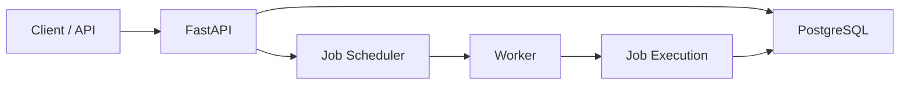

<p align="center">
  <strong>Computer Science Engineer • AI/GenAI Developer • Software Engineer</strong>
</p>

<p align="center">
  <a href="https://github.com/Kshitij7498">
    
  </a>
</p>

<p align="center">
  <a href="https://readme-typing-svg.demolab.com">
    
  </a>
</p>

<p align="center">
  
  
  
</p>

<p align="center">
  <a href="https://github.com/Kshitij7498">
    
  </a>
  <a href="www.linkedin.com/in/kshitij-raghatate-a39722275">
    
  </a>
  <a href="[kshitijraghatate7498@gmail.com](mailto:kshitijraghatate7498@gmail.com)">
    
  </a>
  
</p>

---

## 🧑‍💻 About Me

I'm **Kshitij Gajanan Raghatate**, a Computer Science & Engineering student at **Shri Guru Gobind Singhji Institute of Engineering & Technology (SGGS), Nanded**.

I enjoy building **real-world software systems** at the intersection of:

<div align="center">

| 🤖 AI |      ⚙️ Backend     |   🧩 DSA   |   🌐 Web   |  🔐 Security  | 📊 Data |
| :---: | :-----------------: | :--------: | :--------: | :-----------: | :-----: |
| GenAI | Distributed Systems | Algorithms | Full Stack | Cybersecurity |    ML   |

</div>

I'm particularly interested in:

* 🤖 Generative AI & LLM applications
* 🔎 Retrieval-Augmented Generation
* ⚙️ Backend & Distributed Systems
* 🧩 Data Structures & Algorithms
* 🌐 Full-Stack Development
* 🔐 Secure Software Engineering
* 📊 Data Science & Machine Learning
  


---

# 🤖 Featured Projects


<div align="center">

## ⚙️ Distributed Job Scheduler

### `Python` `FastAPI` `PostgreSQL` `Alembic` `Docker`

</div>

A distributed job scheduling system designed to explore **production-oriented backend and distributed-system architecture**.

### 🏗️ System Flow



### Core Concepts

<div align="center">

| 🔄 Scheduling  | 👷 Workers          | 🗄️ Database | 🌐 API    | 🐳 Infrastructure |
| -------------- | ------------------- | ------------ | --------- | ----------------- |
| Job Scheduling | Worker Registration | PostgreSQL   | REST APIs | Docker            |
| Job Types      | Distributed Workers | Alembic      | FastAPI   | Containers        |
| Job Processing | Worker Execution    | Migrations   | Backend   | Services          |

</div>

---


<div align="center">

### ⚖️ Ethical-Kranti-AI

**AI-powered legal research engine using RAG & Gemini**

`GenAI` `RAG` `LLMs` `Gemini API` `LangChain` `NLP`

---

### 🔐 Secure File Encryptor / Decryptor

**C++ based secure file encryption and decryption system**

`C++` `File Handling` `Encryption` `Security`

---

### 💬 Real-Time Talking Chat Application

**Real-time communication application**

`JavaScript` `Real-Time Communication` `Web Development`

---

### 🧠 AI Career Couch

**AI-powered career assistance application**

`TypeScript` `AI` `Career Guidance` `Web Development`

---

### ⚙️ Codity.ai Distributed Job Scheduler

**Distributed job processing and scheduling system**

`Python` `FastAPI` `PostgreSQL` `Docker` `Distributed Systems`

</div>

---

# 🛠️ Tech Stack

## 👨‍💻 Languages

<div align="center">


</div>

---

## 🤖 AI / Machine Learning

<div align="center">


<br><br>

`Generative AI` • `LLMs` • `RAG` • `LangChain` • `Gemini API`

<br>

`Prompt Engineering` • `NLP` • `NumPy` • `Pandas` • `Matplotlib`

</div>

---

## 🌐 Web Development

<div align="center">


</div>

---

## ⚙️ Backend & Systems

<div align="center">


<br><br>

`REST APIs` • `Distributed Systems` • `Database Design` • `Microservices`

</div>

---

## 🔧 Tools

<div align="center">


<br><br>

`Git` • `GitHub` • `VS Code` • `Postman` • `Docker` • `Render` • `Vercel`

</div>

---

# 🧩 My Engineering Interests

<div align="center">

```text
                    🤖 ARTIFICIAL INTELLIGENCE
                              │
                    ┌─────────┴─────────┐
                    ↓                   ↓
                   LLMs                RAG
                    │                   │
                    └─────────┬─────────┘
                              ↓
                     🧠 AI APPLICATIONS
                              │
                              ↓
                    ⚙️ BACKEND ENGINEERING
                              │
                    ┌─────────┴─────────┐
                    ↓                   ↓
                   APIs             Databases
                    │                   │
                    └─────────┬─────────┘
                              ↓
                   🌐 DISTRIBUTED SYSTEMS
                              │
                              ↓
                     🚀 RELIABLE SOFTWARE
```

</div>

---

# 🧠 Problem Solving

<div align="center">

## **350+ DSA Problems Solved**


</div>

### Areas I Practice

```text
Arrays & Strings
      ↓
Linked Lists → Stack → Queue → Hashing
      ↓
Recursion & Backtracking
      ↓
Trees → Binary Trees → Graphs
      ↓
Sorting → Searching → Greedy
      ↓
Dynamic Programming
      ↓
Basic System Design
```

> 🎯 **The objective isn't just solving problems — it's learning how to think.**

---

# 📚 Computer Science Fundamentals

<div align="center">

|            Domain            | What I Focus On                   |
| :--------------------------: | :-------------------------------- |
|          🧩 **DSA**          | Algorithms & Problem Solving      |
|           ☕ **OOP**          | Object-Oriented Design            |
|         🗄️ **DBMS**         | SQL, Normalization & Transactions |
|           💻 **OS**          | Processes, Threads & Memory       |
|        🌐 **Networks**       | TCP/IP, HTTP & Networking         |
|  ⚙️ **Distributed Systems**  | Workers, Scheduling & Reliability |
|     🔐 **Cybersecurity**     | Security Fundamentals             |
| 🏗️ **Software Engineering** | SDLC, Architecture & Testing      |

</div>

---

# 🎓 Education

<div align="center">

### 🏛️ Shri Guru Gobind Singhji Institute of Engineering & Technology

**B.Tech — Computer Science & Engineering**

`2023 ━━━━━━━━━━━━━━━━━━━ 2027`

</div>

---

# 🏆 Certifications & Learning

<div align="center">


</div>

### Currently / Previously Explored

`Generative AI Fundamentals`

`Prompt Engineering`

`LLM Applications`

`Retrieval-Augmented Generation`

`LangChain`

`NLP Fundamentals`

`Data Science & Machine Learning`

`CUDA Python`

---

# 📊 GitHub Analytics

<div align="center">


</div>

<br>

<div align="center">


</div>

---

# 📈 Contribution Activity

<div align="center">

<p align="center">
  
</p>
</div>

---

# 🐍 Contribution Graph

<div align="center">


</div>

---

# 🚀 My Development Philosophy

<div align="center">

```text
        ┌───────────────┐
        │     LEARN     │
        └───────┬───────┘
                ↓
        ┌───────────────┐
        │   UNDERSTAND  │
        └───────┬───────┘
                ↓
        ┌───────────────┐
        │     BUILD     │
        └───────┬───────┘
                ↓
        ┌───────────────┐
        │     BREAK     │
        └───────┬───────┘
                ↓
        ┌───────────────┐
        │     DEBUG     │
        └───────┬───────┘
                ↓
        ┌───────────────┐
        │    IMPROVE    │
        └───────┬───────┘
                ↓
        ┌───────────────┐
        │    DEPLOY     │
        └───────┬───────┘
                ↓
        ┌───────────────┐
        │    REPEAT 🔁  │
        └───────────────┘
```

</div>


---

# 🌐 Let's Connect

<div align="center">

I'm interested in:

`🤖 AI / GenAI`

`💻 Software Engineering`

`⚙️ Backend & Distributed Systems`

`🧠 DSA & Problem Solving`

`🌐 Open Source`

`🚀 Building Useful Products`

<br>

<a href="https://github.com/Kshitij7498">

</a>


